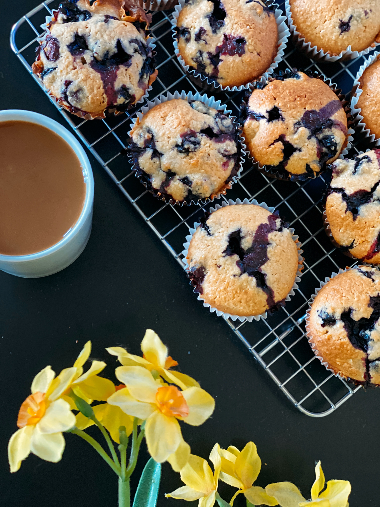

These healthy blueberry oat muffins are absolutely delicious and easy to make.  

#### Ingredients:
- 1 ½ cups of oat flour
- 1 tsp baking powder
- 3 large eggs
- ½ tsp salt 
- ¼ cup coconut Oil
- ⅓ cup maple syrup
- 1 tbsp vanilla extract
- ¼ cup milk 
- ½ cup fresh blueberries 

Oat Crumble Topping:
- ½ cup oat flour
- ¼ cup oats
- ⅓ cup coconut sugar
- 1 tsp cinnamon
- ½ tsp. salt
- ½ stick melted butter

#### Instructions 
- Combine all dry ingredients (oat flour, baking powder, salt) in a medium size bowl.
- Combine all wet ingredients (whisk eggs, maple syrup, coconut oil, vanilla extract and milk)
- Mix wet and dry ingredients with a spatula until smooth.
- Prepare a muffin pan with 6 large muffin liners and add equal amounts mixture to each liner 
- For the oat crumble combine all ingredients except for butter. The add melted butter and blend with a fork.
- Add a thick layer of oat crumble on top of each muffin 
- Bake at 350°F for 25-30 minutes 
