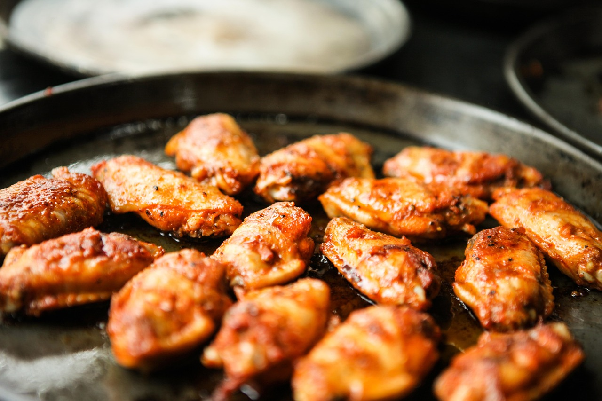

This simple recipes yet tasty recipe will elevate your dinner experience. You'll be wanting more 

#### Ingredients:
- 2 tablespoons salt
- 1 tablespoon paprika
- 2 teaspoons ground black pepper
- 1 1⁄2 teaspoons onion powder
- 1 1⁄2 teaspoons dried oregano
- 1 1⁄2 teaspoons ground cumin
- 1 teaspoon garlic powder
- 1 teaspoon chili powder
- 1 pound of chicken wings
#### Instructions
- In a bowl, stir together the salt, paprika, black pepper, onion powder, oregano, cumin, garlic powder, and chili powder. Pat dry the wings and place them in a large bowl Sprinkle the Adobo seasoning over the wings, tossing to evenly coat. Line a baking sheet with parchment paper and place the seasoned wings in  single layer. Bake at 425°F for 35-60 minutes depending on the size of the wings. Once the wings are golden brown, remove them from the over and serve them with your favorite sauce 

#### Sauce Recomendations 
